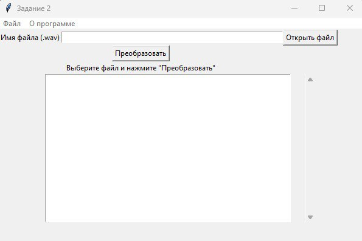

.. TRPO-project documentation master file, created by
   sphinx-quickstart on Tue Oct  3 20:32:36 2023.
   You can adapt this file completely to your liking, but it should at least
   contain the root `toctree` directive.

Документация TRPO-project
=================================

.. toctree:: ./about.rst
   :maxdepth: 2
   :caption: О программе

.. toctree:: ./tz.rst
   :maxdepth: 2
   :caption: Техническое задание

Ниже представлен пользовательский интерфейс программы:

.. toctree:: ./main.rst
   :maxdepth: 2
   :caption: Документация
